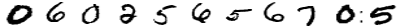

# MNIST Sequence Generator
\
This is a python implementation of _generate numbers sequence_ and _generate phone numbers_ functions. The code can be used as standalone script or _pip installable package_. Below is a brief about each of these functions.
1. *generate_numbers_sequence()*: Given an Iterable with a sequence of integers, generates a numpy array with a random representation of each integer from **MNIST digits dataset**.
2. *generate_phone_numbers()*: Given an input integer _n_, using *generate_numbers_sequence()* generates _n_ different random phone number (leading digit 0, followed by 10 digits) like sequences.
* For the above, on being provided an _output path_, both functions will save the generated numpy arrays as _*.png_ file(s). 
* The width of the final generated image has to be provided as an input.
* To ascertain the proper working of the above functions, relevant unittests have been implemented.
    * *test_generate_numbers_sequence.py*: Ascertains that the returned values from *generate_numbers_sequence()* are of expected _type, shape, range_.
    * *test_generate_phone_numbers.py*: Checks if the expected number of files have been generated and the files meet the defined specifications.

### Data Generator
For machine learning applications, a separate *DataGenerator* class is implemented. The generator class inherits from *generate_phone_numbers()* above and returns an input-output pair, such that,
* _input_: (bath_size, image_height, image_width), *image_width* is user specified, whereas *image_height* is set to default (==28) of **MNIST digits dataset**.
* _output_: (batch_size,), with each element being a string representing phone-number like sequence in the image files.

## Environment
* python == ^3.8 (tested with 3.8, 3.9)
* numpy
* matplotlib
* Pillow
* requests

## Installation Guideline

```sh
git clone git@github.com:Anuj040/seqgen.git [-b <branch_name>]
cd seqgen (Work Directory)

# local environment settings
pyenv local 3.9.1                             # Choose python of choice
python -m pip install poetry
poetry config virtualenvs.create true --local
poetry config virtualenvs.in-project true --local

# In case older version of pip throws installation errors
poetry run python -m pip install --upgrade pip 

# local environment preparation
poetry install

```
## Dataset preparation
* Check if the original dataset is available, if not, download from https://data.deepai.org/mnist.zip.
* Get the unsigned bytes from the gzip file for images and labels (train set only for now)
* Extract the images and labels, into the desired shapes and data types (_uint8_).
* Filter the indices for each digit in the dataset (_python dict_).
* In *generate_numbers_sequence()*, convert the data type for images to _float32_, and invert the colors (white: background, black: text).

## Standalone Usage
All commands should be executed from Work Directory
### Sequence Image Generator
To use sequence image generator, please input the following from command line
```python
poetry run python number_generator/api.py sequence --image_width 150 --output_dir outputs --digits 78677
```
**Note**: Digits flag should be one single string of integers
### Phone Number Generator
Please use the following from command line
```python
poetry run python number_generator/api.py phone --num_images 3 --image_width 150 --output_dir outputs
```

## Packaging
### Building a package
* Make a setup.py with required METADATA for the package
* make the package with ```poetry run python setup.py bdist_wheel```　or ```make build```

The above step should provide the following in the work directory.
```sh
    seqgen {work_directory}
    ├── number_generator
    ├── build                  
    │   ├──lib                               
    │   │   ├──
    │   │     :
    │   ├── ...
    │
    ├── dist                  
    │   ├──number_generator-0.1-py3-none-any.whl  
    │
    ├──number_generator.egg-info
    ├──setup.py
    :
    └── ...
```
### Installing the package
```python
python -m pip uninstall {path_to}/dist/number_generator-0.1-py3-none-any.whl
```
### Using the package
With the above steps in place, one should be able to import the _number_generator_ module
```python
import number_generator
from number_generator import generate_numbers_sequence, generate_phone_numbers

# returns a numpy array
img = generate_numbers_sequence(digits=[4, 1, 1], image_width=None)

# Generates 10 images of phone number like sequences
generate_phone_numbers(10, image_width=500, output_path="outputs")
```

## Trade-offs
* Since the problem statement required the output in the form black text over white background, I had to decide whether to do the flip in the _data handler_ script or *generate_numbers_sequence* function. I implemented the latter as it allows me to extend _data handler_ script to future application not requiring this reversal.
* Declaring _LOADER_ (DataLoader class instance in _num gen_ script) as a global variable or local variable in *generate_numbers_sequence* function. I chose the former as it avoids reinitializing the loader for every call to *generate_numbers_sequence* function from *generate_phone_numbers* function.
    * However, a case can be made for for declaring it in *generate_phone_numbers* function and passing it with every call to *generate_numbers_sequence* function.
* What kind of data structure to use for storing *random sequences* in *generate_phone_numbers* function. Used *set()* to take care of the duplicacies inherently.
* By default images are not saved for *generate_numbers_sequence* function. Only done if an output directory is provided as an argument. This is done keeping with a view to extend its usage, if need be, where saving the image is not necessarily required. 
    * However, for the _API_ saving the images is the default behaviour, as per the requirements of the assignment.
* For saving and resizing images *Pillow* is used. Other choice I had was OpenCV. But *OpenCV* has a tendency to throw very cryptic errors sometimes, so decided on *Pilllow*.
* For image augmentations, I have implemented custom functions for noise and affine augmentation. Usually, I will use a public module like *imgaug* or *opencv* however, I recently moved to Apple M1 and it is facing a lot of issues with the installation of various libraries. So, for this project, I decided to skip with the standard libraries. If I necessarily need to do that, I believe I could do that using a docker container but I have not tested it on my machine, so can't be certain.
* Augmenting a 'single digit image' versus augmenting the 'sequence image'. Whenever possible, go for the latter to decrease the number of *augmenter* function.
* For the DataGenerator class, whether to inherit from *generate_numbers_sequence()* or *generate_phone_numbers()*. Chose the latter, as at the current stage, with no particular end task in sight, *generate_phone_numbers()* provides an easier implementation for data batches.
* Final output of the model: LSTM(_n_ units) versus _n_ dense layers, where _n_ is the sequence length. Now, in principle, the presence of a digit at a given place is independent of the digit at the preceding place. However, we use the same latent features to predict the whole sequence, therefore, a given prediction should be aware of the digits predicted prior. This is to enable the adjustment of the attention on the latent features accordingly. 
    * Just for completeness, I tested replacing the LSTM layer with a single Dense layer of _n_ units (rest of the model architecture kept same) and the performance was significantly worse. Infact, it predicted pretty much the same digit (except the leading "0") for all the positions.
* Given the simplicity of the **MNIST digits**, for the *core section* of the model architecture, I thought a simple series of fully connected (FC) layers should suffice. However, on testing, a convolution layer (+ FCs) based core-model performed better than just a bunch of FC layers. One possible reason is, of course, the sequence nature (+ augmentations) of the images imply that the dataset is not simple anymore. Also, the induced translational bias from convolutions help in better separation of features.


### Pending Imporvements/Features
* Progress bar for data download from the internet
* Would like to include more augmentations but due to Apple M1 issue mentioned above, for now I have given up on that. 
* spacing
* Multiple worker training: _"RuntimeError: Your generator is NOT thread-safe"_. Need to work on this, though at the moment I do not have much experience in this.
* In the current structure, setting "seed" for the data generator is generating the same batche over and over. Will need to fix that for proper evaluation of the model performance.
* Right now, in this crude form of the model architecture, the accuracy of the predicted digits is barely hitting 80% and is overly parameterized (20 million+, becasue to FCs), so I plan to further look into possible measures (training strategies or architecture changes) to optimize the model performance.
* Further, implement test datatset based image sequences for true validation of the model. Currently, using fixed samples from train dataset images as a proxy (example below).
* Implement *spacing range* parameter in the original _generate numbers sequence_ and _generate phone numbers_ functions. At the time of submission, I still had not received clarification for this argument, so could not do it.

### Example Test Sample
\
Ground truth: [0 6 0 2 5 6 5 6 7 0 5]\
Predicted:[0 6 0 2 4 6 5 6 7 0 4]
